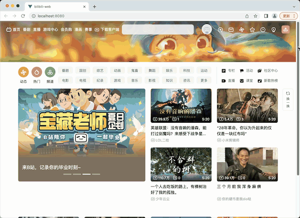

# bilibili-web
基于vue3框架的仿bilibili视频网站项目（客户端）  
服务端在 https://gitee.com/seasontuza/bilibili-server  
数据库文件在 https://gitee.com/seasontuza/bilibili-sql

# 说明 
由于b站视频做了加密处理，无法爬到原视频信息，该项目所有视频数据为 https://test-streams.mux.dev/x36xhzz/x36xhzz.m3u8  

# 进度

## ---2023.3.31 
初版在 https://gitee.com/seasontuza/bilibili/tree/master/client  

1、基本页面制作（主页、视频详情页、用户主页、登录注册页）  
2、基于iView组件制作轮播图等  
3、主页视频懒加载  
4、使用token完成用户登录、注册功能  
5、用户点赞、评论功能

## ---2023.6.18 
1、基于bootstrap完成响应式方案设计  
2、注册增加图像验证码功能  
3、完善首页动画。包括头像的hover大小图变化，缓冲占位推荐视频的动画，头图随鼠标移动的动画  
4、改进无限加载功能。原方案为只要滚动就会增加占位图；改为获得到数据前不增加占位图，避免一次性加载过多数据  
5、对结构重新划分，分为更多的小组件，方便修改和管理  
6、使用autoprefixer插件考虑浏览器兼容问题

## ---2023.7.8 
1、bilibili播放器相关功能（播放暂停、倍速、音量调节、全屏）  
2、使用HLS(HTTP Live Streaming)实现视频码率无缝切换、隐藏真实视频网址、渐进式下载  
3、实现视频弹幕功能  
4、使用websocket实时显示“几人在看”功能  
5、使用requestAnimationFrame代替setInterval  
6、使用hidpi-canvas解决canvas模糊问题

## ---未来工作  
1、历史观看记录  
2、web性能优化  
3、如何更加完善地考虑兼容性问题（鼠标、键盘、requestAnimationFrame等）  
4、进度条丝滑拖拽  
5、鼠标移到预览窗口自动播放视频  
6、私信功能  
7、改掉头图的setinterval  
8、检查是否移除事件监听，避免内存泄漏  
9、用户订阅新视频通知  
10、视频播放器功能完善，如弹幕设置、网页全屏  
11、视频播放量增加（官方规则为：一个账号对同一个视频每天最多只能计算4次的播放量，每次需要间隔6个小时，同一个电脑IP，就算切换不同的账号，也只能计算一次播放量）  
12、Web Worker处理WebSocket连接和消息传递   
13、进度条小电视拖拽动画（svg动画）  
14、如何适应流量增加和数据存储需求  
15、refresh token，无感刷新

# 功能演示 
1、首页响应式布局  
  

2、视频无限加载  
  
  
3、首页动画（轮播图、导航栏鼠标滑过跳跃效果、左侧导航“说爱你”轮播、大小头像变化、眨眼头图鼠标跟随效果） 

头图资源：https://www.bilibili.com/video/BV1Vr4y1c7vK/?is_story_h5=false&p=1&share_from=ugc&share_medium=android&share_plat=android&share_session_id=71ff71dd-15a1-407e-b6ca-4c46844dfe5d&share_source=COPY&share_tag=s_i&timestamp=1660816135&unique_k=CpeCCZm&vd_source=3dd8fbf6fbbd8ac2b82ab7b5d8073242  

 
  
4、权限功能（发送弹幕、评论、点赞等，未认证用户点击相应功能会自动跳出登录界面）
 
  
5、注册和登录  
 

6、视频弹幕、播放暂停、调整清晰度、倍速、全屏、拖拽进度条  
 
  
7、发送弹幕  
 

8、发表评论  
 

9、点赞  
 

10、实时显示几人在看
 

11、视频数据加载骨架屏
 

# bug
1、音量调节。添加鼠标移入再显示拖拽条功能后无法调节音量  
2、部分动画bug  
3、video dom位置偏移

